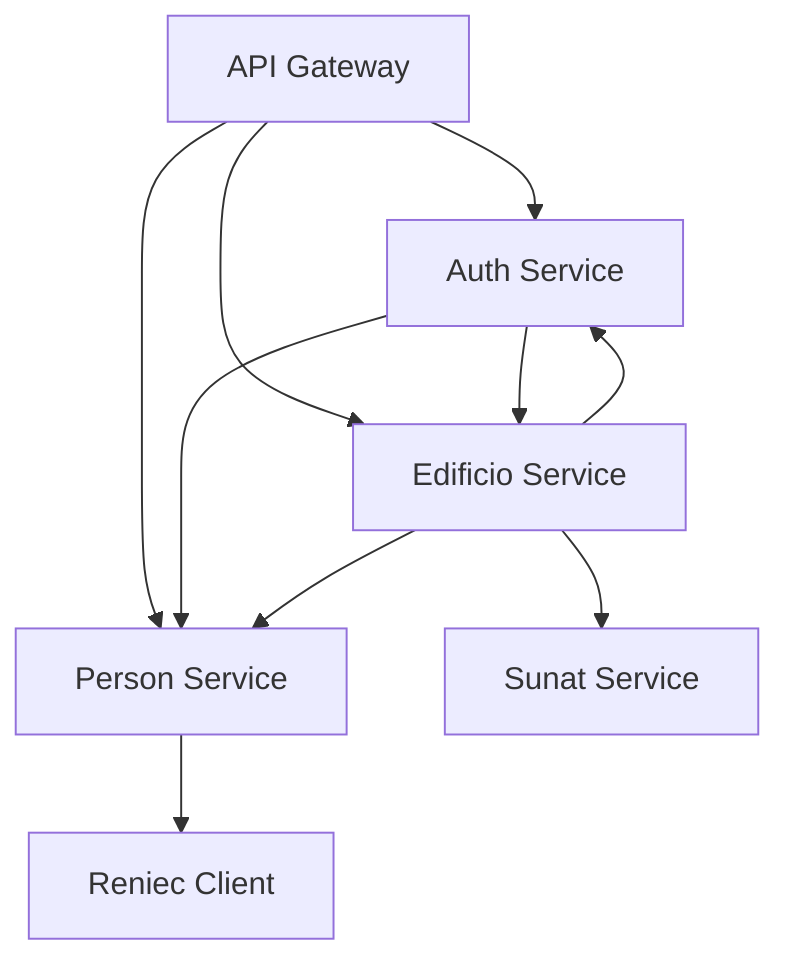
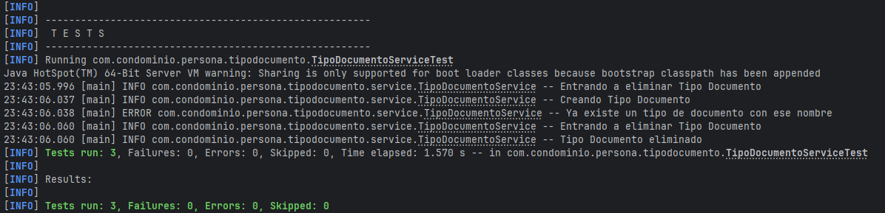
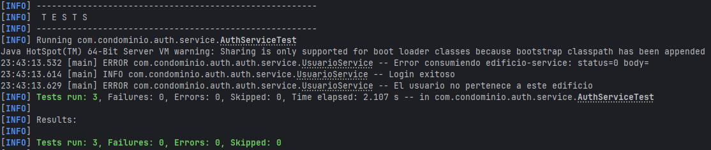
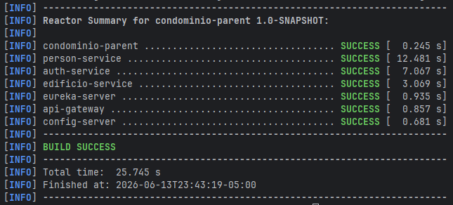
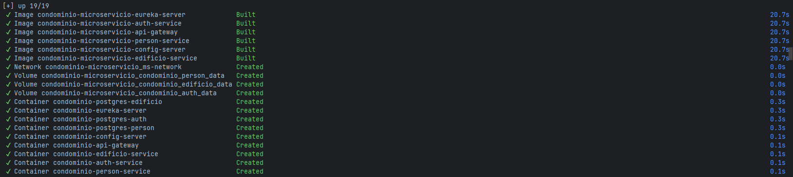
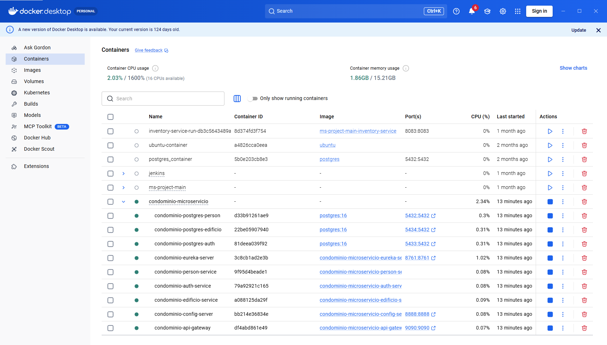
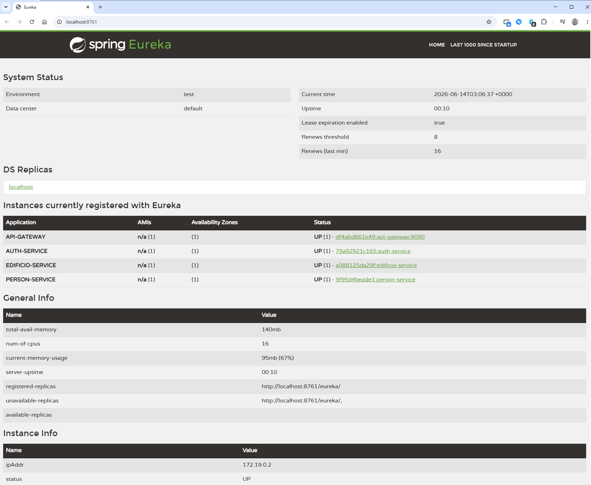

# Sistema de Gestión de Condominios - Arquitectura de Microservicios

## 1. Descripción General

Sistema de gestión de condominios desarrollado bajo una arquitectura de microservicios utilizando Spring Boot, Spring Cloud, PostgreSQL, JWT y Docker.

El objetivo del sistema es administrar edificios, unidades, propietarios, usuarios y control de acceso mediante roles.

---

# 2. Arquitectura General

## Microservicios

| Servicio         | Responsabilidad                                         |
| ---------------- |---------------------------------------------------------|
| auth-service     | Gestión de autenticación, autorización, usuarios        |
| persona-service  | Gestión de personas y tipos de documento                |
| edificio-service | Gestión de empresas, edificios, unidades y propietarios |
| api-gateway      | Punto único de entrada para los clientes                |
| eureka-server    | Descubrimiento y registro de servicios                  |
| config-server    | Centralización de configuraciones                       |

---

# 3. Diseño e Identificación de Microservicios

## 3.1 Auth Service

### Bounded Context

Seguridad y Control de Acceso.

### Entidades

* Usuario
* Tokens (login / refresh)

### Requerimientos Funcionales

* Registro de usuarios (En caso la persona del usuario no se encuentre en el microservicio de person-service, mediante feign lo creará automáticamente)
* Login
* Generación de JWT
* Generación de refresh token
* Logout (por el momento se hace logout del refresh token)
* Logout de todas las sesiones
* Changue pasword
* Forgot password
* Reset Password
* Control de acceso basado en roles (Los roles los consulta mediante feign al microservicio de edificio-service, ya que en este diseño el rol depende del edificio seleccionado)

### Base de Datos

PostgreSQL

### Justificación

Se requiere integridad transaccional y consistencia fuerte para usuarios, roles y credenciales.

### Comunicación

| Servicio Destino  | Tipo                      |
|-------------------| ------------------------- |
| person-service    | Sincrónica (Feign Client) |
| edificio-service  | Sincrónica (Feign Client) |

---

## 3.2 Persona Service

### Bounded Context

Gestión de Personas y Tipos de documento.

### Entidades

* Persona
* TipoDocumento

### Requerimientos Funcionales

* CRUD de tipos de documento
* CRUD de personas
* Consulta al servicio RENIEC para obtener los datos de una persona a partir de su DNI

### Base de Datos

PostgreSQL

### Justificación

La información personal requiere integridad referencial y consistencia transaccional.

### Comunicación


| Servicio Destino | Tipo                      |
|------------------| ------------------------- |
| Reniec-Client    | Sincrónica (Feign Client) |

---

## 3.3 Edificio Service

### Bounded Context

Administración de Condominios.

### Entidades

* Edificio
* Empresa
* PersonaUnidad
* Rol
* Unidad
* UsuarioEdificio
* UsuarioEdificioRol

### Requerimientos Funcionales

* Edificios
  * Creación de edificio (ADMINISTRADOR, ADMINISTRACION)
  * Calculo de porcentaje de participación (ADMINISTRADOR, ADMINISTRACION)


* Empresas
  * Creación de empresa (ADMINISTRADOR, ADMINISTRACION)


* Rol
  * Create (ADMINISTRADOR, ADMINISTRACION)
  * Update (ADMINISTRADOR, ADMINISTRACION)
  * Delete (ADMINISTRADOR)
  * Get (TODOS)
  * Get all (TODOS)


* Unidad
  * Create (ADMINISTRADOR, ADMINISTRACION)
  * Asignar persona-unidad (ADMINISTRADOR, ADMINISTRACION)
  * Listar mis unidades (ADMINISTRADOR, ADMINISTRACION, PROPIETARIO)


* UsuarioEdificio
  * Validación relación usuario-edificio (TODOS)
  * Listado de edificios por usuario (TODOS)


* UsuarioEdificioRol
  * Create (ADMINISTRADOR, ADMINISTRACION)
  * Delete (ADMINISTRADOR)
  * Listado de roles por edificio del usuario (TODOS)
  * Listado de todas las relaciones (TODOS)

### Base de Datos

PostgreSQL

### Justificación

Las operaciones inmobiliarias requieren consistencia transaccional y relaciones complejas entre entidades.

### Comunicación

| Servicio Destino | Tipo                      |
|-----------------| ------------------------- |
| person-service  | Sincrónica (Feign Client) |
| auth-service    | Sincrónica (Feign Client) |
| Sunat-client    | Sincrónica (Feign Client) |

---

# 4. Dependencias Entre Servicios

Se utilizó comunicación sincrónica mediante OpenFeign.

Se eligió este enfoque porque algunas operaciones requieren validar
información en tiempo real antes de completar una transacción.

Ejemplo:
Antes de registrar una relación Persona-Unidad, el Edificio Service
consulta al Person Service para verificar que la persona exista.

No se replican datos entre servicios.

Cada microservicio mantiene la propiedad exclusiva de sus entidades.
Cuando un servicio necesita información de otro dominio, realiza una
consulta mediante API REST utilizando OpenFeign.

Una decisión importante fue no crear claves foráneas entre las tablas
PersonaUnidad y Persona, debido a que pertenecen a microservicios
diferentes.

Aunque una clave foránea simplificaría algunas consultas, habría roto el
principio de independencia de bases de datos por microservicio.

Se decidió almacenar únicamente el idPersona y validar su existencia
mediante llamadas al Person Service.

| Servicio         | Consume                  |
|------------------|--------------------------|
| auth-service     | person-service           |
| auth-service     | edificio-service         |
| person-service   | Reniec-Client            |
| edificio-service | person-service           |
| edificio-service | auth-service             |
| edificio-service | Sunat-service            |
| api-gateway      | todos los microservicios |
| eureka-server    | ninguno                  |
| config-server    | ninguno                  |


### Diagrama lógico

```text
API Gateway
│
├── Auth Service
│   ├── Person Service
│   └── Edificio Service
│
├── Person Service
│   └── Reniec Client
│
└── Edificio Service
    ├── Person Service
    ├── Auth Service
    └── Sunat Service
```

### Diagrama de Dependencias

```text
                ┌──────────────┐
                │ config-repo  │
                └──────┬───────┘
                       │
                       ▼
              ┌──────────────────┐
              │ config-server    │ (8888)
              └──────────────────┘
                       ▲
                       │
    ┌──────────────────┼────────────────────┐
    │                  │                    │
auth-service   person-service     edificio-service
    │                  │                    │
    └──────────── Eureka (8761) ────────────┘
                       │
                   api-gateway (9090)
```

```text
                    API Gateway
                          │
      ┌───────────────────┼───────────────────┐
      │                   │                   │
      ▼                   ▼                   ▼
 Auth Service      Person Service     Edificio Service
      │                   │              ┌──────┴──────┐
      │                   ▼              ▼             ▼
      │            Reniec Client   Person Service  Auth Service
      │
      └──────────────► Edificio Service

                           ▼
                     Sunat Service
```



---

# 5. Modelo de Datos

## Auth Service

```text
Auth service
├── Usuario
└── Token
```

## Persona Service

```text
Person service
├── Persona
└── Tipo Documento
```

## Edificio Service

```text
Edificio service
├── Empresa
|    └── Edificio
|       └── Unidad
|            └── PersonaUnidad
|
└── UsuarioEdificio
    └── UsuarioEdificioRol
         └── Rol
```

---

# 6. Seguridad

El sistema utiliza:

* Spring Security
* JWT Access Token
* Control de acceso por roles

Roles implementados:

* ADMINISTRADOR
* ADMINISTRACION
* PROPIETARIO

---

# 7. Infraestructura

## Eureka Server

Responsable del registro y descubrimiento de servicios.

## API Gateway

Punto único de entrada para todos los clientes.

## Config Server

Centralización de configuraciones externas.

---

# 8. Tecnologías Utilizadas

* Java 21
* Spring Boot 3
* Spring Security
* Spring Cloud Gateway
* Eureka Server
* OpenFeign
* PostgreSQL
* Flyway
* Docker
* JWT
* Lombok
* ModelMapper

---

# 9. Ejecución Local

## Requisitos

* Docker Desktop
* Java 17
* Maven

## Levantar el ecosistema

docker-compose up -d

Servicios:

* Eureka Server
* Config Server
* PostgreSQL Auth
* PostgreSQL Persona
* PostgreSQL Edificio
* Auth Service
* Persona Service
* Edificio Service
* API Gateway

## Verificación

Eureka:

http://localhost:8761

Gateway:

http://localhost:9090

---

## Imagenes













---
# 10. Autores

Proyecto académico desarrollado por Slather Córdova Amez, para el curso de bootcamp de desarrollo web full stack con java.
